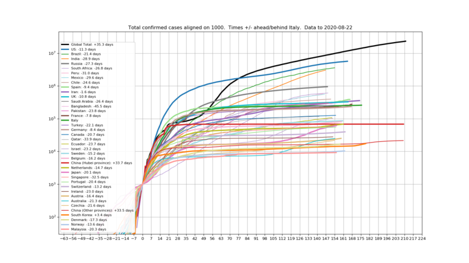

#ArmchairEpidemiology
=====================

Some dubious charts with coronavirus data.

Global
======

Plots created from the JHU tracker's data (available at <https://github.com/CSSEGISandData/COVID-19>).

Case-count growth rates by country (China split Hubei/non-Hubei).  Day-to-day points, and over a 1-week window.  (Click for full-resolution.)

"Active cases", assuming a model where newly identified cases become "active" for 2-3 weeks (uniformly distributed; eventual outcome doesn't matter).  This is an alternative to using JHU's "recovered" counts as there seems to be some doubt about how reliable they are in many countries.

A couple of aligned plots of cumulative case and death count curves.

Some projections of case-counts for worst affected countries, simply by fitting (least squares) some simple models to the data so far.

Note: Model parameters are constrained to only allow growth rates to fall, because it never occurred to me that they'd do anything else!

USA
===

