#ArmchairEpidemiology
=====================

Some dubious charting with coronavirus data.  Images can be clicked-through to full-resolution versions.  Note that most (all?) the non-scatterplot charts are log-scale on the y-axis.  Straight lines are actually exponential growth!

Sections on this page for [global](#global), [UK](#uk) and [USA](#usa) data, and some [Links](#links) to much better pages than this one.

Code (Python, matplotlib) which generated these plots at <https://github.com/timday/coronavirus>.

Global
======

Plots created from the JHU tracker's data (available at <https://github.com/CSSEGISandData/COVID-19>).

Cases
-----

Case-count growth rates by country (China split Hubei/non-Hubei).  Day-to-day increases plotted as points, with the lines showing growth over a 1-week window (this smooths out quite volatile daily rates and should remove any quirks of case reporting at weekends).  

[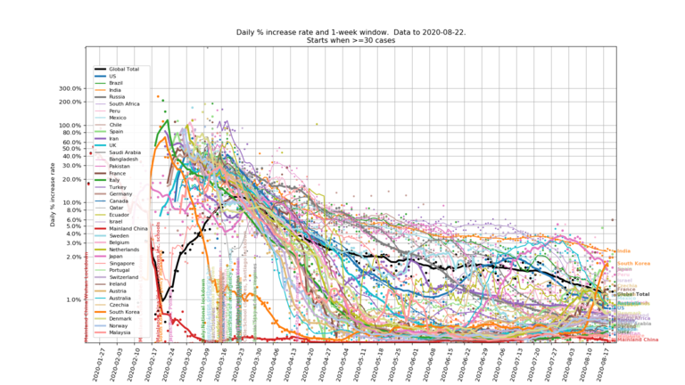](img/global/growth.png)

A couple of aligned plots of the cumulative case and death count curves.

[](img/global/aligned-cases.png)
[](img/global/aligned-deaths.png)

"Active cases", assuming a model where newly identified cases become "active" for 2-3 weeks (uniformly distributed; eventual outcome doesn't matter).  This is an alternative to using JHU's "recovered" counts as there seems to be some doubt about how reliable they are in many countries.

[](img/global/active-log.png)

And alternative views of the same "active cases" but plotting the number as a proportion of a country's population (although splitting China between Hubei and all other provinces).
Log and linear scale plots shown (the linear scale makes it clearer which countries are over the hump).

[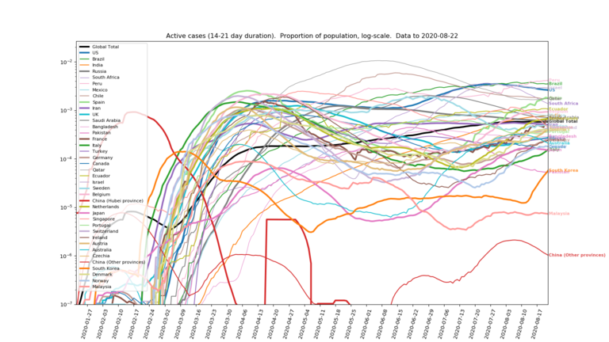](img/global/active-prop-log.png)
[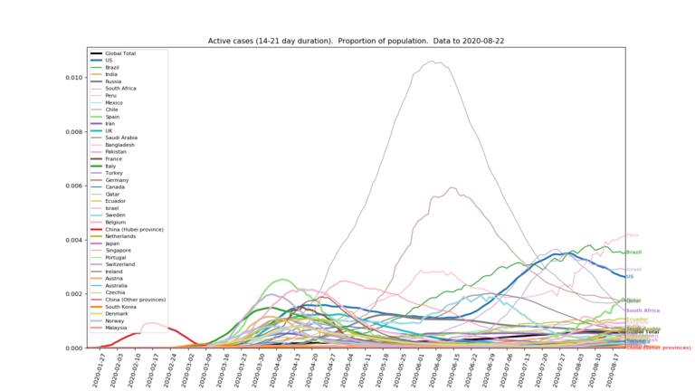](img/global/active-prop-lin.png)

Projections
-----------

Some simple (and very naive) next two months projections of case-counts (and derived "active cases") for the worst affected countries, simply by fitting (least squares) some simple models to the data so far.
Models include straight exponential growth, variants with the growth rate decaying linearly or exponentially, with or without a constant floor, the logistic equation and linear decay to zero growth at a given time.
In the chart legends there are 1-3 tick marks against the top 3 models best fitting the data.
The best 3 models are also shown rendered as "active cases" (assuming each new case then has a uniform duration of 2-3 weeks of being "active" before it is resolved).

[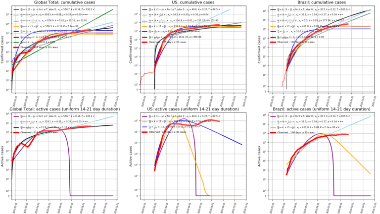](img/global/projections-0.png)
[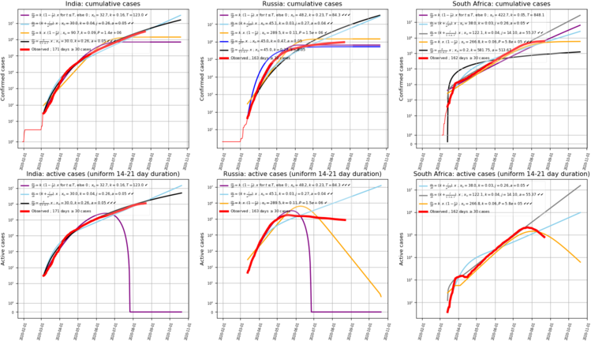](img/global/projections-1.png)
[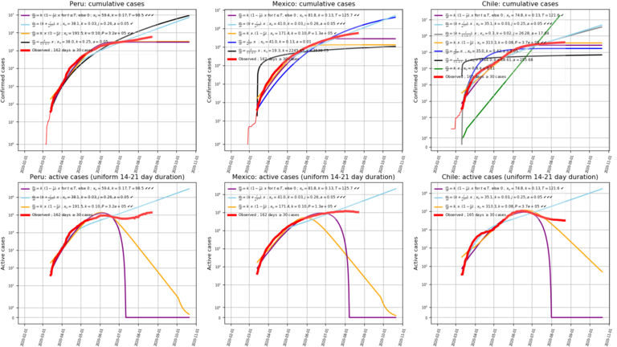](img/global/projections-2.png)
[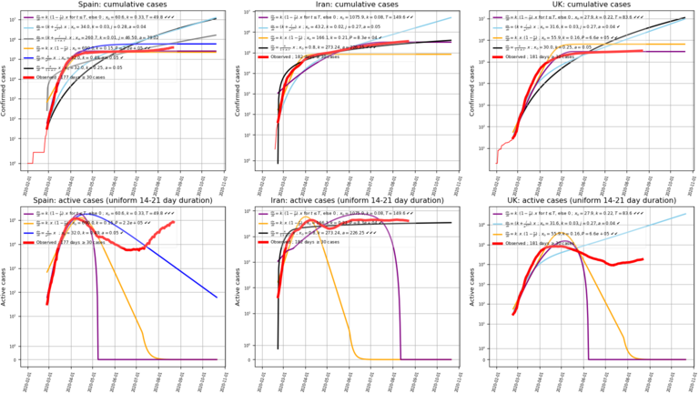](img/global/projections-3.png)

Note: Model parameters are constrained to only allow growth rates to fall, because it never occurred to me that they'd do anything else!  So the best-fit "straight exponential growth" line (green) acts as an upper limit, and the variable-rate models can't actually flex above it even if that was a better fit.  Of course in practice, "case counts" must be at least as much a function of test and diagnostic capacity and policies as they are of any actual underlying growth of the disease itself.

UK
==

Data from the gov.uk tracker at <https://coronavirus.data.gov.uk/> as curated into `.csv` file timeseries by <https://github.com/tomwhite/covid-19-uk-data>.

A messy plot of all the individual UTLAs/health-boards case counts:

[](img/uk/cases-log.png)

Aligning all those on a constant number of cases:

[](img/uk/cases-aligned-log.png)

The "active cases" assuming new cases are active for 2-3 weeks (uniform distribution):

[](img/uk/cases-active-log.png)

Correlations
------------
From the ONS, there is some UTLA-level data available (for England) for various health and deprivation metrics.  Is there some correlation between these measures and the rate that virus case-counts are growing at?

### Health

From the health data (from <https://www.ons.gov.uk/peoplepopulationandcommunity/healthandsocialcare/healthinequalities/datasets/indicatorsoflifestylesandwidercharacteristicslinkedtohealthylifeexpectancyinengland>, a 2017 release of 2015 data?), the score most correlated with the virus case-count growth rate appears to be the area's obesity rate:

[](img/uk/health-Obesity rate percentage.png)

A snapshot of the correlations with all the various health metrics (using case-count growth rates over the week prior to the date shown, sorted by the magnitude of the latest figures):
```
                                               Week to     Week to     Week to     Week to     Week to     Week to    Week to    Week to 
                                              01/04/2020  08/04/2020  15/04/2020  22/04/2020  01/05/2020  15/5/2020  29/5/2020  13/06/2020
  Smoking prevalence (%)                     :  0.230       0.318       0.211       0.110       0.135       0.103      0.151      0.266
  Obesity rate (%)                           :  0.421       0.505       0.376       0.320       0.426       0.282      0.336      0.243
  Preventable Mortality (deaths per 100,000) :  0.232       0.429       0.221       0.118       0.197       0.106      0.204      0.222
  Adults eating 5-a-day (%)                  : -0.091      -0.145       0.000       0.156       0.101       0.152      0.006     -0.187
  Alcohol-related admissions (per 100,000)   :  0.221       0.470       0.304       0.250       0.347       0.270      0.290      0.155
  Economically inactive (%)                  :  0.121       0.161       0.048      -0.065       0.045      -0.018      0.013      0.102
  Employment rate (%)                        : -0.128      -0.157      -0.017       0.096      -0.043      -0.025     -0.002     -0.102
  Unemployment rate (%)                      :  0.107       0.101      -0.060      -0.145       0.022      -0.031     -0.024      0.072
  Physically active adults (%)               : -0.272      -0.266      -0.120      -0.053      -0.113      -0.002     -0.072     -0.064
```

So - probably unsurprisingly - a general picture of unhealthy things being associated with faster case-count growth, and more health-positive things like physical activity, employment and even "5-a-day" being weakly linked with slower growth.

### Deprivation

From the "deprivation index" data (from <https://www.gov.uk/government/statistics/english-indices-of-deprivation-2019>, the score most correlated with the virus case-count growth rate initially appeared to be "Education, Skills and Training" (higher score = worse!), but other deprivation indices have since taken over:

[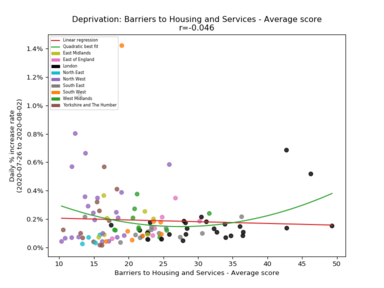](img/uk/deprivation-Barriers.png)
[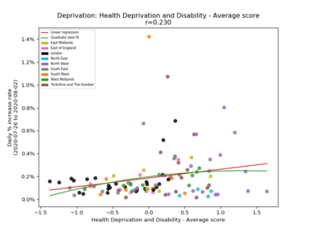](img/uk/deprivation-Health.png)
[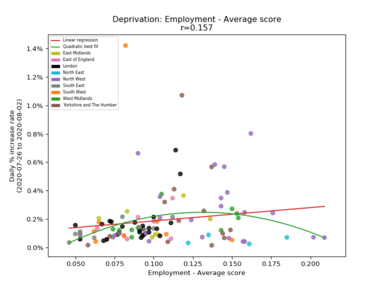](img/uk/deprivation-Employment.png)
[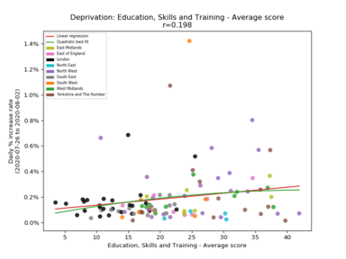](img/uk/deprivation-Education.png)

A snapshot of the correlations with all the various deprivation metrics (using case-count growth rates over the week prior to the date shown, sorted by the magnitude of the latest figures):
```
                                      Week to     Week to     Week to     Week to     Week to     Week to     Week to     Week to
                                     01/04/2020  08/04/2020  15/04/2020  22/04/2020  01/05/2020  15/05/2020  29/05/2020  13/06/2020
  Education, Skills and Training    :  0.395       0.463       0.356       0.315       0.456       0.244       0.377       0.327
  Barriers to Housing and Services  : -0.332      -0.552      -0.455      -0.356      -0.449      -0.386      -0.358      -0.247
  Health Deprivation and Disability :  0.282       0.512       0.297       0.203       0.324       0.166       0.282       0.199
  Crime                             :  0.087       0.090      -0.023      -0.106      -0.094      -0.113       0.072       0.179
  Employment                        :  0.300       0.498       0.236       0.186       0.295       0.144       0.242       0.167
  IMD                               :  0.205       0.322       0.122       0.054       0.168       0.025       0.158       0.165
  Income                            :  0.183       0.293       0.060       0.003       0.107      -0.013       0.119       0.133
  IDACI                             :  0.162       0.242       0.036      -0.015       0.091      -0.030       0.103       0.103
  Living Environment                : -0.308      -0.256      -0.240      -0.269      -0.184      -0.239      -0.218       0.037
  IDAOPI                            : -0.061      -0.073      -0.226      -0.284      -0.215      -0.233      -0.117      -0.008
```
(IMD - "Index of Multiple Deprivations", an aggregate score; IDACI - "Income Deprivation Affecting Children Index"; IDAOPI - "Income Deprivation Affecting Older People Index")

Note that while for most of these "deprivation index" numbers a higher score implies more deprivation, that appears to be reversed for the "Living Environment" score.  I'm not sure of the interpretation of the "Barriers to Housing and Services" score either, but a high number seems to be frequently associated with wealthy (and therefore unaffordable) areas.

### Brexit and demographics

Plotting case-count growth against the 2016 Leave vote also shows some correlation:

[](img/uk/brexit-England.png)

Reminder: correlation is not causation! And calling COVID-19 "The Brexit Disease" or "Leave Fever" would just be silly.

Initially, plotting case-count growth against demographics from the 2011 census showed very little correlation, but it seems to have become more correlated over the weeks I've been plotting this:

[](img/uk/oldies-England.png)

There is actually a rather large correlation between the same demographic measure and the Leave vote (so the initial lack of correlation was quite surprising).

[](img/uk/oldies-vote-England.png)

### Elections

Unsurprisingly, given the previous section's results, the highest correlation I can find with 2017-2018 election data (England only) is the swing from the Conservative+UKIP vote share in 2017 to the Conservative+Brexit party vote share in 2019:

[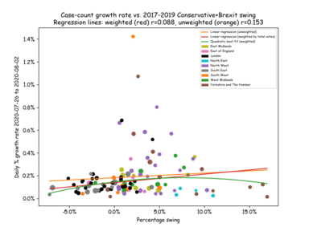](img/uk/election-SwingConBrexit.png)

### Income

Finally, case-count growth rate vs. GDHI ("gross disposable household income per head")

[](img/uk/income-GDHI per head.png)

Money is quite an effective anti-viral it seems.

USA
===

A plot of coronavirus cases growth rate over the last week (JHU's data again) vs. each state's 2016 Trump vote (sized/weighted by total vote).

[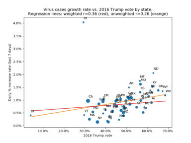](img/usa/president-2016.png)

Unsurprisingly, the chart is pretty much flipped left-right for the 2012 & 2008 Obama votes.

[](img/usa/president-2012.png)
[](img/usa/president-2008.png)

Not particularly interesting trend-lines; there was more of a slant to them in the early days but that might just have been regional timing of the initial growth surges.  California and Texas possibly dominate the weighted regression line.

Links
=====

* If you're not running the Covid-19 Symptom Tracker app... why not?  <https://covid.joinzoe.com/>.
    * Updates and webinars by the team behind this app at <https://covid.joinzoe.com/blog>.
    * App now also available for the USA at <https://covid.joinzoe.com/us>.
* The FT is doing some interesting charting: <https://www.ft.com/coronavirus-latest>.
* But Information Is Beautiful has the best looking: <https://informationisbeautiful.net/visualizations/covid-19-coronavirus-infographic-datapack/>
* Various "dashboard" pages:
    * [JHU's global page.](https://gisanddata.maps.arcgis.com/apps/opsdashboard/index.html#/bda7594740fd40299423467b48e9ecf6)
    * [Worldometer's large collection of data.](https://www.worldometers.info/coronavirus/)
    * [PHE's UK page.](https://coronavirus.data.gov.uk/)
    * [A page tracking Scotland.](https://www.travellingtabby.com/scotland-coronavirus-tracker/)
* Interesting read on why pandemic modelling is hard: <https://fivethirtyeight.com/features/why-its-so-freaking-hard-to-make-a-good-covid-19-model/>
* ...and another one on all the problems with case-counts: <https://fivethirtyeight.com/features/coronavirus-case-counts-are-meaningless/>
