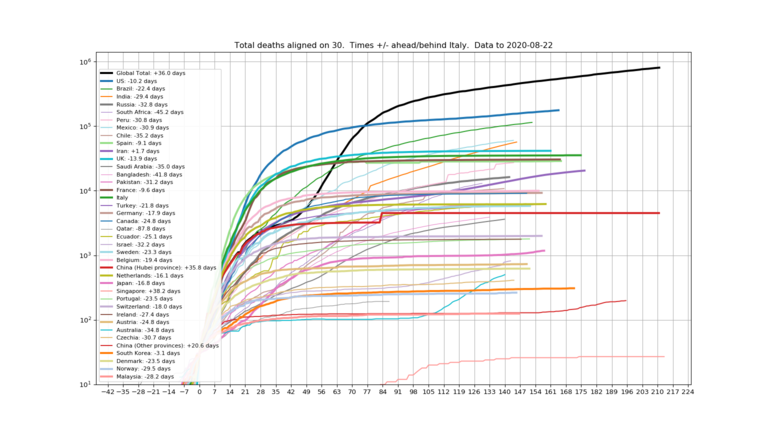
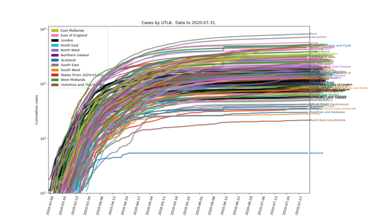
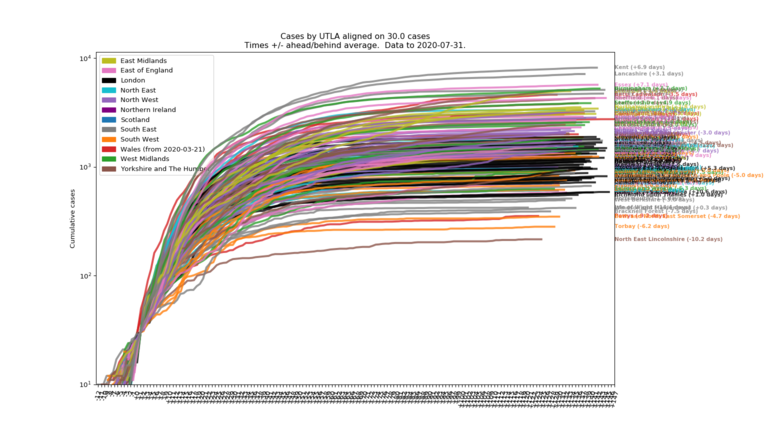
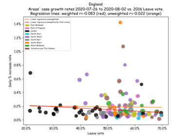
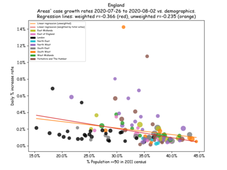
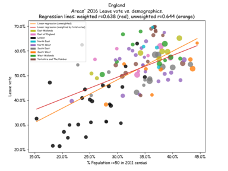
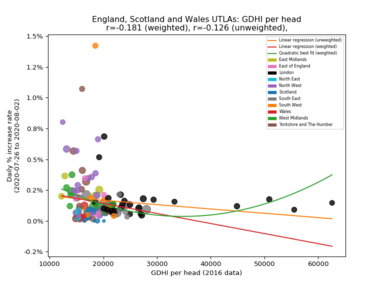
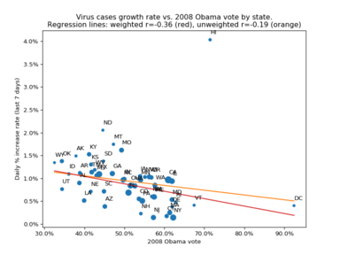

#ArmchairEpidemiology
=====================

Some dubious charting with coronavirus data.  Images can be clicked-through to full-resolution versions.  Note that most (all?) the non-scatterplot charts are log-scale on the y-axis.  Straight lines are actually exponential growth!

Sections on this page for [global](#global), [UK](#uk) and [USA](#usa) data, and some [Links](#links) to much better pages than this one.

Code (Python, matplotlib) which generated these plots at <https://github.com/timday/coronavirus>.

Global
======

Plots created from the JHU tracker's data (available at <https://github.com/CSSEGISandData/COVID-19>).

Cases
-----

Case-count growth rates by country (China split Hubei/non-Hubei).  Day-to-day increases plotted as points, with the lines showing growth over a 1-week window (this smooths out quite volatile daily rates and should remove any quirks of case reporting at weekends).  

[](img/global/growth.png)

"Active cases", assuming a model where newly identified cases become "active" for 2-3 weeks (uniformly distributed; eventual outcome doesn't matter).  This is an alternative to using JHU's "recovered" counts as there seems to be some doubt about how reliable they are in many countries.

[](img/global/active-log.png)

A couple of aligned plots of cumulative case and death count curves.

[](img/global/aligned-cases.png)
[](img/global/aligned-deaths.png)

Projections
-----------

Some simple (and very naive) next-month projections of case-counts for worst affected countries, simply by fitting (least squares) some simple models to the data so far.  In the chart legends there are 1-3 tick marks against the top 3 models best fitting the data.

[](img/global/projections-0.png)
[](img/global/projections-1.png)

Note: Model parameters are constrained to only allow growth rates to fall, because it never occurred to me that they'd do anything else!  So the best-fit "straight exponential growth" line (green) acts as an upper limit, and the variable-rate models can't flex above it.

UK
==

Data from the [PHE tracker](https://www.arcgis.com/apps/opsdashboard/index.html#/f94c3c90da5b4e9f9a0b19484dd4bb14) as curated into `.csv` file timeseries by <https://github.com/tomwhite/covid-19-uk-data>.

A messy plot of all the individual UTLAs/health-boards case counts:

[](img/uk/cases-log.png)

Aligning all those on a constant number of cases:

[](img/uk/cases-aligned-log.png)

Correlations
------------
From the ONS, there is some UTLA-level data available (for England) for various health and deprivation metrics.  Is there some correlation between these measures and the rate that virus case-counts are growing at?

### Health

From the health data (from <https://www.ons.gov.uk/peoplepopulationandcommunity/healthandsocialcare/healthinequalities/datasets/indicatorsoflifestylesandwidercharacteristicslinkedtohealthylifeexpectancyinengland>, a 2017 release of 2015 data?), the score most correlated with the virus case-count growth rate appears to be the area's obesity rate:

[](img/uk/health-Obesity rate percentage.png)

A snapshot of the correlations with all the various health metrics (using last week's case-count growth rates as of 1st April 2020):
```
  Obesity rate (%)                                  :  0.421
  Physically active adults (%)                      : -0.272
  Preventable Mortality (deaths per 100,000)        :  0.232
  Smoking prevalence (%)                            :  0.230
  Alcohol-related admissions (per 100,000)          :  0.221
  Employment rate (%)                               : -0.128
  Economically inactive (%)                         :  0.121
  Unemployment rate (%)                             :  0.107
  Adults eating 5-a-day (%)                         : -0.091
```

So - probably unsurprisingly - a general picture of unhealthy things being associated with faster case-count growth, and more health-positive things like physical activity, employment and even "5-a-day" being weakly linked with slower growth.

### Deprivation

From the "deprivation index" data (from <https://www.gov.uk/government/statistics/english-indices-of-deprivation-2019>, the score most correlated with the virus case-count growth rate appears to be "Education, Skills and Training" (higher score = worse!):

[](img/uk/deprivation-Education.png)

A snapshot of the correlations with all the various deprivation metrics (using last week's case-count growth rates as of 1st April 2020):
```
  Education, Skills and Training          :  0.395
  Barriers to Housing and Services        : -0.332
  Living Environment                      : -0.308
  Employment                              :  0.300
  Health Deprivation and Disability       :  0.282
  IMD                                     :  0.205  - "Index of Multiple Deprivations" (an aggregate score?)
  Income                                  :  0.183
  IDACI                                   :  0.162  - Income Deprivation Affecting Children Index
  Crime                                   :  0.087
  IDAOPI                                  : -0.061  - Income Deprivation Affecting Older People Index
```
Note that while for most of these "deprivation index" numbers a higher score implies more deprivation, that appears to be reversed for the "Living Environment" score.  I'm not sure of the interpretation of the "Barriers to Housing and Services" score either, but a high number seems to be frequently associated with wealthy ( and therefore unaffordable) areas.

### Brexit and demographics

Plotting case-count growth against the 2016 Leave vote also shows some correlation:

[](img/uk/brexit-England.png)

Reminder: correlation is not causation! And calling COVID-19 "The Brexit Disease" or "Leave Fever" would just be silly.

However, perhaps surprisingly, plotting case-count growth against demographics from the 2011 census there seems to be very little connection:

[](img/uk/oldies-England.png)

which seems all the more surprising considering that there is actually a rather large correlation between the same demographic measure and the Leave vote:

[](img/uk/oldies-vote-England.png)

### Income

Finally, case-count growth rate vs. GDHI ("gross disposable household income per head")

[](img/uk/income-GDHI per head.png)

Money is quite an effective anti-viral it seems.

USA
===

A plot of coronavirus cases growth rate over the last week (JHU's data again) vs. each state's 2016 Trump vote (sized/weighted by total vote).

[](img/usa/president-2016.png)

Unsurprisingly, the chart is pretty much flipped left-right for the 2012 & 2008 Obama votes.

[](img/usa/president-2012.png)
[](img/usa/president-2008.png)

Not particularly convincing looking trend-lines though.

Links
=====

* If you're not running the Covid-19 Symptom Tracker app... why not?  <https://covid.joinzoe.com/>.
    * Updates and webinars by the team behind this app at <https://covid.joinzoe.com/blog>.
    * App now also available for the USA at <https://covid.joinzoe.com/us>.
* The FT is doing some interesting charting: <https://www.ft.com/coronavirus-latest>.
* But Information Is Beautiful has the best looking: <https://informationisbeautiful.net/visualizations/covid-19-coronavirus-infographic-datapack/>
* Various "dashboard" pages:
    * [JHU's global page.](https://gisanddata.maps.arcgis.com/apps/opsdashboard/index.html#/bda7594740fd40299423467b48e9ecf6)
    * [Worldometer's large collection of data.](https://www.worldometers.info/coronavirus/)
    * [PHE's UK page.](https://www.arcgis.com/apps/opsdashboard/index.html#/f94c3c90da5b4e9f9a0b19484dd4bb14)
    * [A page tracking Scotland.](https://www.travellingtabby.com/scotland-coronavirus-tracker/)
